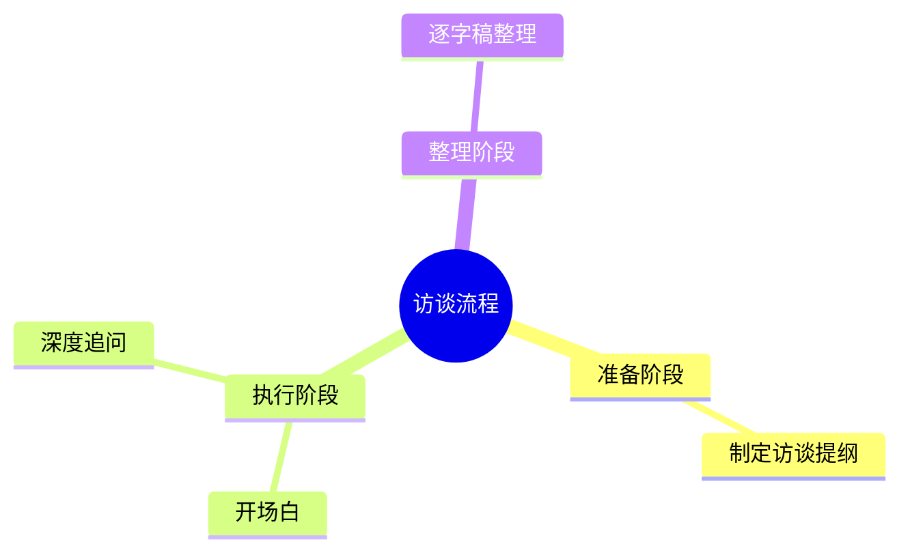

# SPEC-INS-002 — 对话流与输出卡片（Conversation & OutputCard）

> 状态：草案 · 优先级 P1 · 规模 [M] · 领域 ui/insight
>
> 上游已实现：✓ SessionTurn 渲染工具调用/markdown/reasoning；✗ "输出卡片"概念；✗ 卡片点击跳转 ResultViewer

---

## 1. 目标

将对话区从"气泡流"改造为**紧凑的任务流**：
- 用户消息 = 附件 chips + 指令文本（紧凑，不是气泡）
- Agent 思考过程 = 可折叠的"思考完毕 ▼"块（复用上游 reasoning 渲染）
- Agent 产出 = **输出卡片**（文件图标 + 任务名 + 时间戳），点击在 ResultViewer 打开

---

## 2. 上游现状

| 能力 | 状态 | 位置 |
|---|---|---|
| `SessionTurn` 完整消息渲染 | ✓ | `packages/ui/src/components/session-turn.tsx` |
| Reasoning 折叠块 | ✓ | `message-part.tsx:1512+ PART_MAPPING["reasoning"]` |
| 工具调用卡片（tool-card） | ✓ | `basic-tool.tsx`, `tool-count-summary.tsx` |
| Markdown 渲染 | ✓ | `packages/ui/src/context/marked.tsx` |
| **输出卡片（Artifact card）** | ✗ | 需自写 |
| **卡片→Tab 联动** | ✗ | 需自写 |

**策略**：直接使用 `<SessionTurn>` 渲染工具调用和 reasoning；在其外层包一层 InsightTurn，拦截最终的 `text` Part，解析出 Artifact 元数据，渲染为输出卡片。

---

## 3. 布局（对照设计稿，对话区宽度约 280px）

```
┌──────────────────────────────────┐
│ [用户消息]                        │
│  ┌─────────────────────────────┐  │
│  │ [docx] 访谈大纲.docx    [×]  │  │ ← AttachmentBar（发送后只读显示）
│  │ [docx] 逐字稿.docx      [×]  │  │
│  └─────────────────────────────┘  │
│  业务背景：算子开发工具规划进行…    │ ← 用户文本（截断，展开按钮）
├──────────────────────────────────┤
│ [Agent 过程]                      │
│  ▶ 思考完毕（点击展开 reasoning） │ ← 折叠块，复用上游 reasoning
│  ▶ 调用了 3 个工具               │ ← tool-count-summary（可选显示）
├──────────────────────────────────┤
│ [输出卡片]                        │
│  ┌─────────────────────────────┐  │
│  │ [📄] 算子开发工具访谈        │  │
│  │      - 观点解析              │  │ ← 点击 → ResultViewer 打开 Tab
│  │      创建时间：2026-04-27…   │  │
│  └─────────────────────────────┘  │
└──────────────────────────────────┘
```

---

## 4. 输出卡片（OutputCard）规则

### 4.1 什么时候出现卡片

Agent 最终 text Part 结束后（`session.idle` 事件触发），解析最后一条 assistant 消息：

1. **包含 markdown 表格**（`|---|`）→ 卡片类型 `table`，标题取第一行 `##` 或默认"分析结果"
2. **包含 mermaid 代码块**（` ```mermaid `）→ 卡片类型 `mindmap`
3. **包含 JSON 代码块**（` ```json `）→ 卡片类型 `json`
4. **其余纯文本**（> 200 字）→ 卡片类型 `markdown`
5. **工具调用产出文件**（write/patch Part）→ 卡片类型 `file`，标题取文件名

> 规则按序匹配，取第一个命中项；如果均未命中（短回复、确认语句），不生成卡片，保持普通文本显示。

### 4.2 卡片 UI

```tsx
// 卡片外观
<div class="rounded-lg border border-border-base bg-surface-base p-3 cursor-pointer hover:bg-surface-raised">
  <div class="flex items-center gap-2">
    <FileTypeIcon type={card.type} />                    // 图标（按类型）
    <div class="flex flex-col gap-0.5 min-w-0">
      <span class="text-13-medium text-text-strong truncate">{card.title}</span>
      <span class="text-11-regular text-text-weak">{formatTime(card.createdAt)}</span>
    </div>
  </div>
</div>
```

图标映射：
- `table` → 表格图标（grid）
- `mindmap` → 思维导图图标（branch）
- `markdown` → 文档图标
- `file` → 对应 MIME 图标
- `json` → 花括号图标

### 4.3 卡片点击行为

点击 OutputCard → 触发父组件回调 `onOpenResult(card)` → ResultViewer 新建/切换到对应 Tab。

---

## 5. InsightTurn 组件设计

```
insight/components/insight-turn.tsx
  InsightTurn(props: {
    sessionID: string
    message: Message
    parts: Part[]
    status: SessionStatus
    active: boolean
    onOpenResult: (card: OutputCard) => void
  })
```

内部逻辑：
1. 用户消息 → `<UserTurnDisplay>` 显示附件 chips（只读）+ 文本
2. Assistant 消息 → `<SessionTurn>` 渲染 reasoning/tool 部分（隐藏最终 text Part）
3. `session.idle` 后解析最终 text Part → 生成 `OutputCard[]` → 渲染卡片列表

---

## 6. 生成中状态

Agent 执行期间：
- 卡片占位符：虚线边框 + spinner + "正在生成…"
- reasoning 块自动展开（用户可手动折叠）
- `session.idle` 后：占位符变为正式卡片，title/type 确定

---

## 7. 验证步骤

> 以下提示词设计为"强制模型输出特定格式"，可直接粘贴到输入框发送。  
> 前提：已启动 opencode server，InsightPage 可正常与 Agent 通信。

### 7.1 触发 OutputCard（表格类型）

**发送以下提示词：**
```
请用 Markdown 表格列出 5 个典型用户研究访谈痛点，每行包含三列：
| 痛点描述 | 严重程度（高/中/低） | 出现频率（高/中/低） |
只输出表格，不要额外说明。
```

**预期现象：**
1. 对话区出现"⏳ 正在生成…"虚线占位符（session.busy 期间）
2. Agent 回复完成（session.idle）后，占位符消失，出现 **OutputCard**
3. 卡片显示：`⊞` 图标 + 标题（取自 `## xxx` 或默认"分析结果"）+ 时间戳
4. ✅ 如果只看到正常的 SessionTurn 文本而无卡片 → `detectCard()` 未命中，检查是否有 `|---|` 分隔行

### 7.2 触发 OutputCard（Mermaid 类型）

**发送以下提示词：**
```
请用 mermaid mindmap 语法画出用户访谈流程的思维导图，只输出代码块，格式如下：

```

**预期现象：**
1. 回复完成后 OutputCard 出现，类型标识为 `⎇`（mindmap 类型）

### 7.3 触发 OutputCard（长文本 Markdown，> 200 字）

**发送以下提示词：**
```
请写一份 300 字以上的用户研究访谈报告摘要，包含背景、关键发现和建议三个部分，用 Markdown 格式。
```

**预期现象：**
1. 回复文本超过 200 字，OutputCard 出现，类型标识为 `📋`（markdown 类型）

### 7.4 不生成卡片（短回复）

**发送以下提示词：**
```
你好
```

**预期现象：**
1. Agent 给出简短回复（< 200 字，无表格/mermaid/json）
2. ✅ 对话区**不出现** OutputCard，仅显示正常 SessionTurn 文本

### 7.5 多轮对话卡片持久性

1. 先完成 7.1（已有一个表格卡片）
2. 继续发送"你好"触发短回复（7.4）
3. ✅ 预期：第一轮的 OutputCard 依然显示，不因新一轮 session.busy 而消失

---

## 8. 不做

- ✗ 卡片内嵌预览（点击只打开 Tab，不在卡片内展开）
- ✗ 多轮对话下删除某条历史消息
- ✗ 对话区内编辑已发送消息
